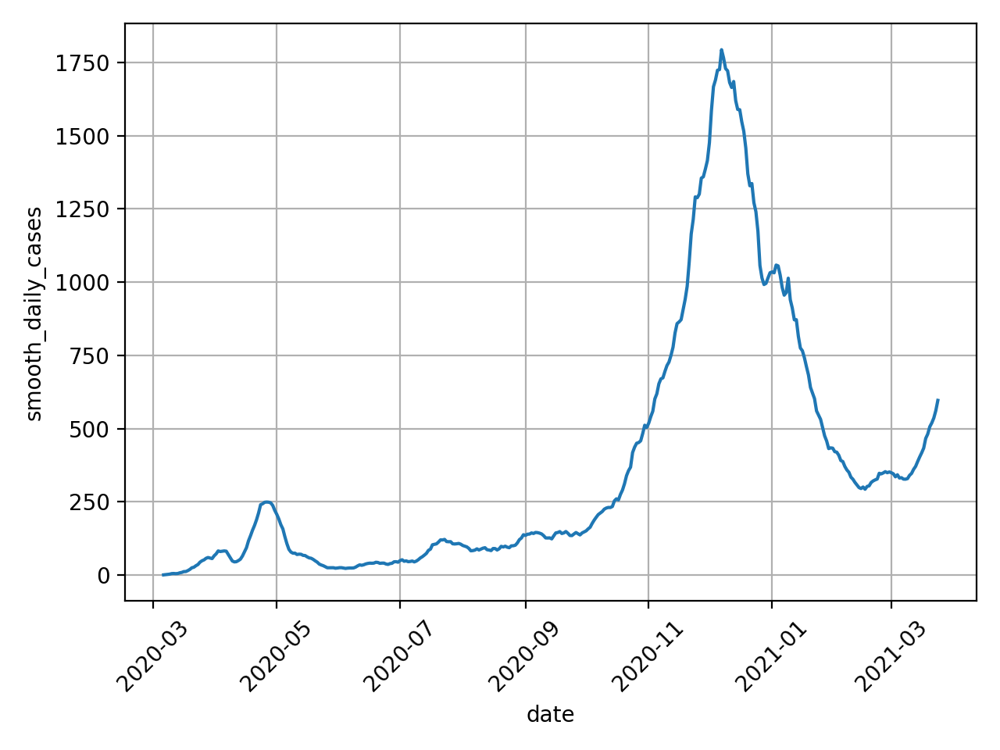
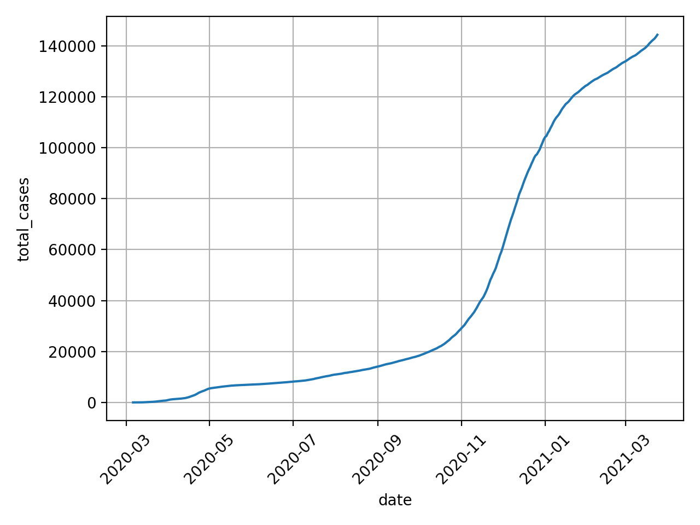
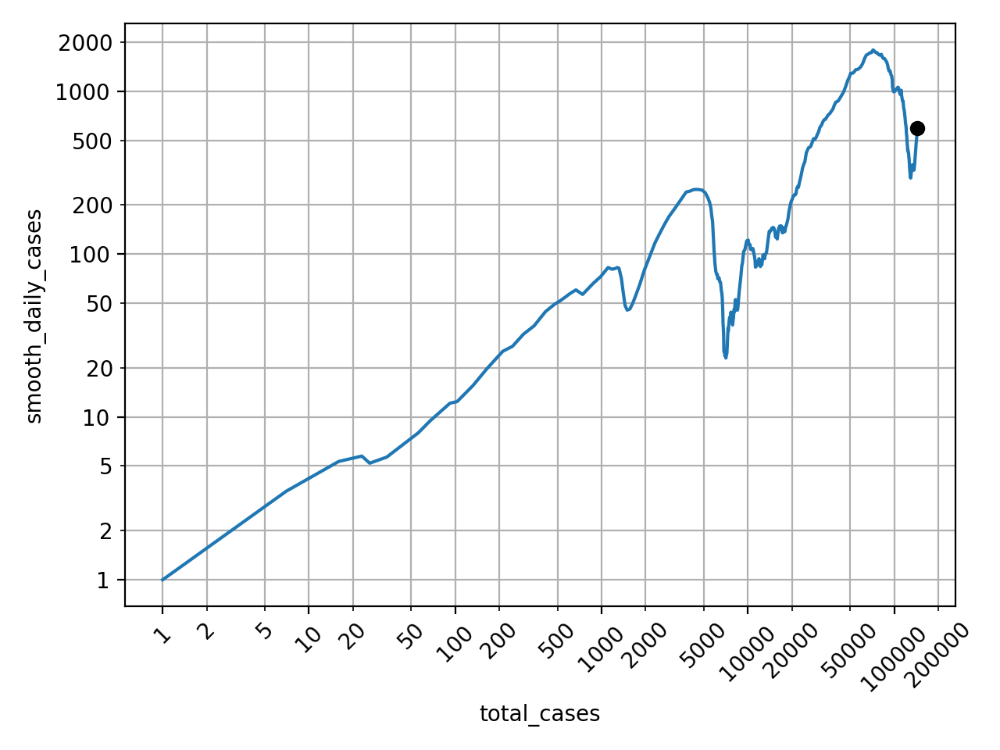
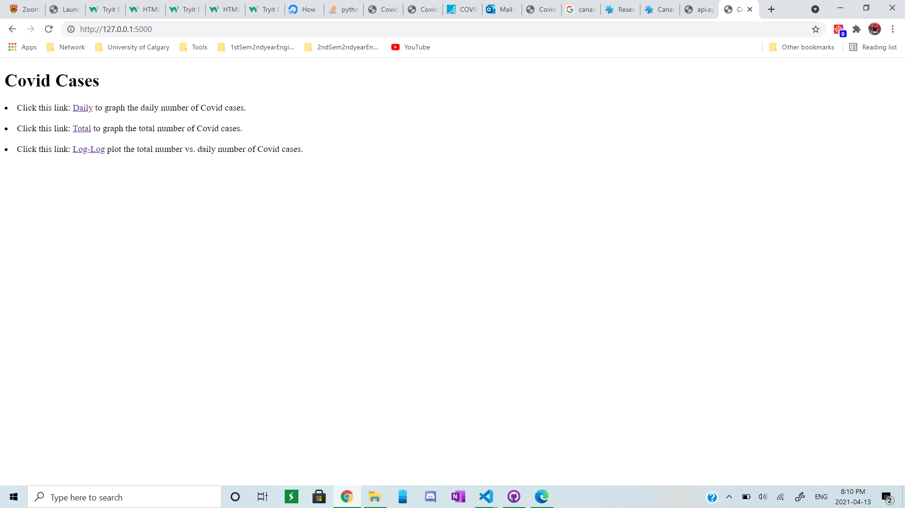
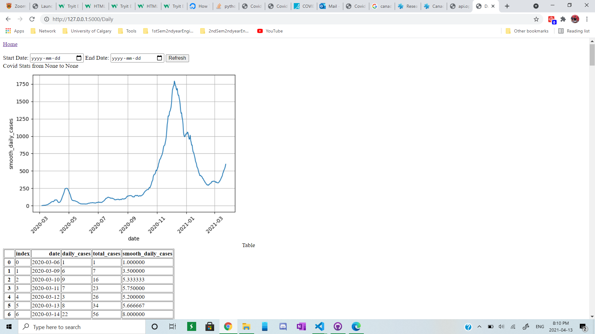
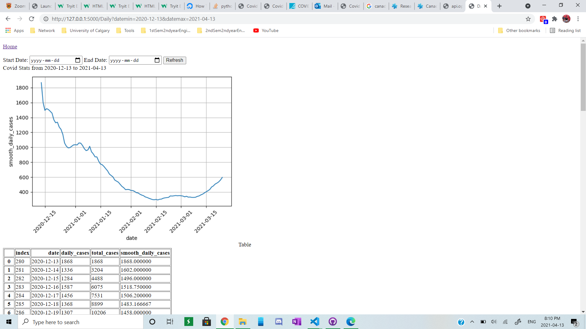
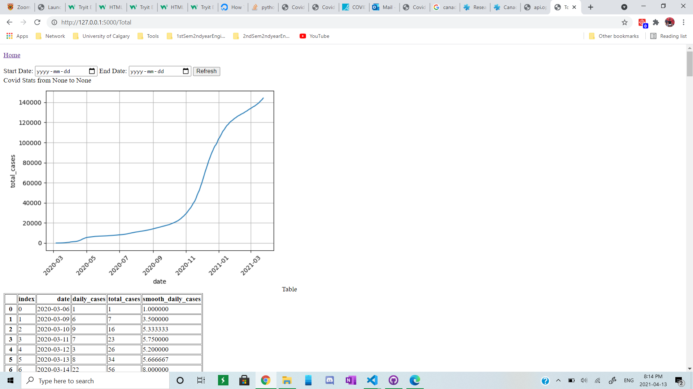
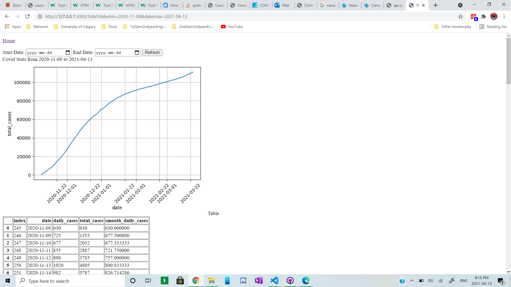
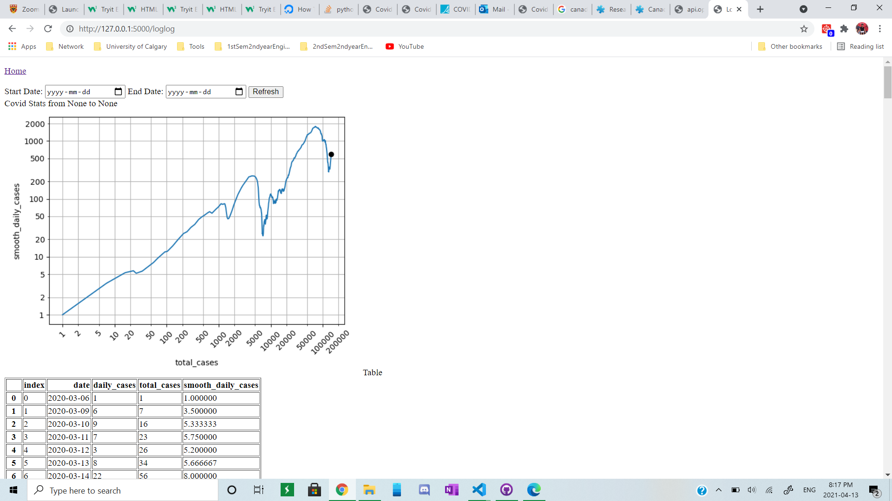
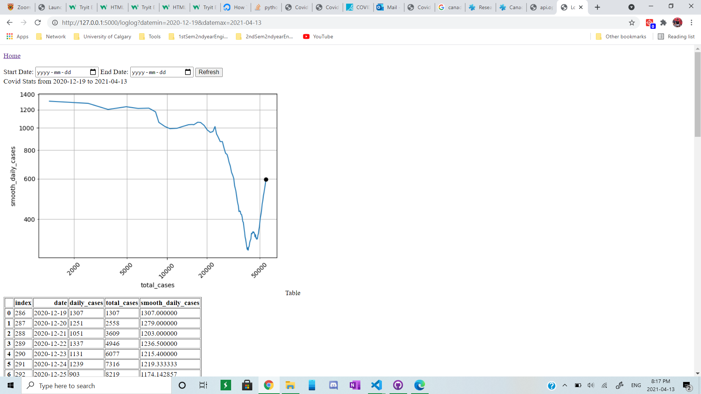

# a5-web_data_to_graph
Create a web application that turns data into graphs.

# Problem statement
The goal is to use our skills to build a COVID-19 data visualization.

Let's assume one of your colleagues implemented some prototypes.
In the `data` sub-directory, you will find `measurements.db`, an Sqlite database with daily counts of new infections in Alberta. In the `tools` sub-directory, there are two Python programs that:
- `covid_csv2database.py`: turn a covid19stats.alberta.ca csv file into a Sqlite database
- `covid_plot.py`: read values from Sqlite database and produce plots (see below)

The file `a5-flask_covid_plot.py` contains a Flask server able to read the database, plot daily new infections using Matplotlib/Seaborn and return the plot in png format to the browser.

Based on these prototypes, the goal is to develop a web application:
1. Similar to the route `'/daily'`, add two more routes and view functions:
    - `'/total'`: Total infections as a function of time as a lineplot (see Figure2 in `covid_plot.py`).
    - `'/loglog'`: Log-Log plot of total infections (x-axis) and daily new infections smoothed with moving average (y-axis) (see Figure3 in `covid_plot.py`).
2. Add a root route `'/'` and view function to return an HTML with Flask templates in `templates/index.html` 
3. The template of the root route in `templates/index.html` should contain hyperlinks to reach the three plot routes: `'/daily'`, `'/total'`, `'/loglog'`.
4. (optional) Update `measurements.db` with the latest numbers.
5. (optional) Add a CSS stylesheet.
6. (optional) Add a mechanism for the user to select a date range.
7. (optional) With a route and view to add new, remove existing measurements to/from the database.
8. (optional) With a route and view to view all measurements in table format.

The first two plots, lineplots for daily and total infections, are often seen in the media. The log-log plot is a format to better understand if we reached the hight of a wave, and was proposed in this video [Minutephysics - How To Tell If We're Beating COVID-19](https://www.youtube.com/watch?v=54XLXg4fYsc). Here are plots produced by `tools/covid_plot.py`:

# What to do
Watch the video [Minutephysics - How To Tell If We're Beating COVID-19](https://www.youtube.com/watch?v=54XLXg4fYsc) to learn about the log-log plot and its interpretation. 
Study the code in `tools/covid_plot.py` that implements desired plots reading from a measurement database.

Implement the web application components as outlined by mandatory elements 1. - 3. above by editing the following files in this directory:
- `a5-flask_covid_plot.py`
- `templates/index.html`

Follow the [Style Guide](StyleGuide.md), make sure all files contain your name as author, and use git and github to track your changes.

Edit `README.md` (this file) and include instructions on how to run your program and expected outputs (screenshots) in the _How to run this program_ section below. 

In the section *Reflection*, include what you liked or disliked; found interesting, confusing, challenging, motivating while working on this assignment.

Make sure final version of your code and updated `README.md` with referenced files (screenshots etc.) are committed to git and pushed to github. 

# How to run this program
1) Run a5-flask_covid_plot.py 
2) Open the web server route produced in the terminal
3) Three hyperlinks will show: Daily number of Covid Cases, total number of Covid Cases, and total number versus daily number of Covid Cases.
4) Click on one of these links to produce a plot that show the given information described by the hyperlinks.
5) Click "Home" to return to the hyperlinks
6) When the plots are shown, you can manipulate the date ranges.
7) Underneath the plots shows the table of the cases.

# Screenshots of the program

Hyperlinks

Daily Covid Cases

Daily Covid Cases with Date Range

Total Covid Cases

Total Covid Cases with Date Range

Log-Log Plot

Log-Log Plot with Date Range

# Reflection
At the start of the assignment, I had some difficulties. Primarily from the reasons that I had errors when downloading anaconda and its libraries; the location of the paths that I had selected was not very nice. When running the python files, vscode had some troubles locating the imported libraries. The fix was to change the path to ../anaconda3/library/bin, in this way vscode or python is run in the path where the imports exists. However, the path needs to be in '../data' because python also needs to access the file measurements.db . This problem became very messy because I needed the path to be in two locations at the same time; one to access the imported libraries under anaconda3/libraries/bin and two to access the file measurements.db . I had no idea to the fix. I tried transferring the library to the same folder as the file but this did not fix and ended up with Github complaining that I was no longer the owner. I reverted back the locations and tried again. However, this time it fixed, vscode somehow knows now where the libraries are located and I moved on with the assignment. The next parts were relatively easy as all it took was to copy the code in covid_plot.py and make minor changes to implement the three different plots. It was the optionalities that were difficult and posed problems. I implemented the date functionality but I was missing one key element and that is to get the date that the user defined in the calendars. After researching and confirming in the lab sessions, I learned about request.args.get() or request.values.get() and this is able to read the query string in the url and inside the function we can specify a specific string from the query. For example the URL is http://127.0.0.1:5000/loglog?datemin=2020-12-19&datemax=2021-04-13 and query is ?datemin=2020-12-19&datemax=2021-04-13, we can read the specific string using  request.args.get(datemin) and this would 'return 2020-12-19'. However it is required to import request from flask to get this working. I really like doing this project because I find it as a valuable learning tool and also something that I can continue to work on as personal project by adding a functionality that uses a website with a rest api to update the new covid cases. I also learned lots from this assignment with the uses of requests and converting an object file into an image. 
